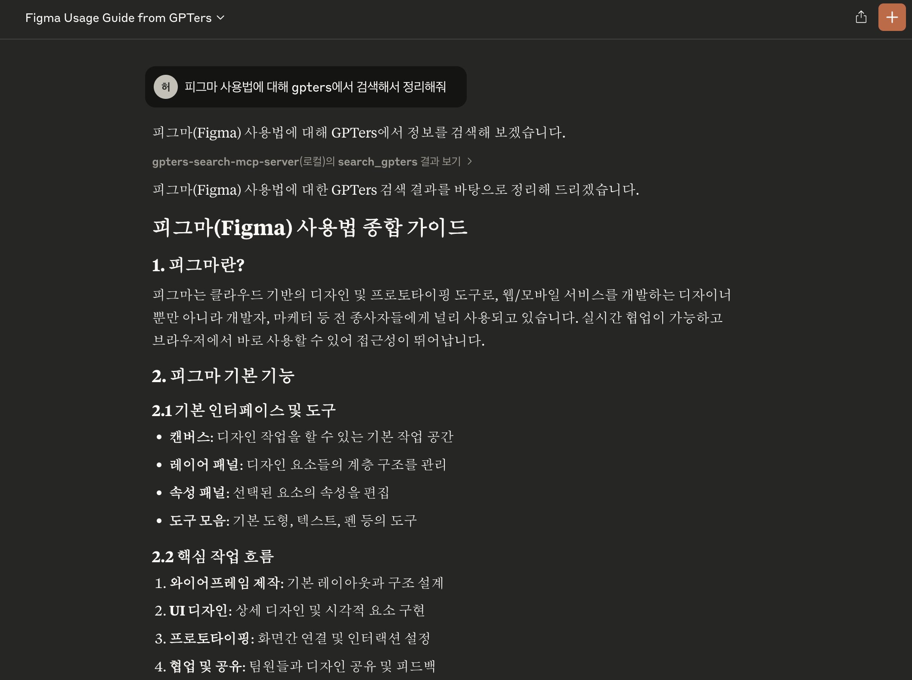
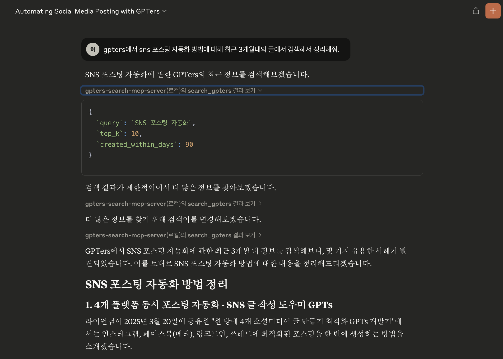

# GPTers Search MCP Server

[](https://smithery.ai/server/@chat-prompt/gpters-search-mcp-server)

본 MCP 서버는 GPTers AI 스터디 커뮤니티의 지식을 검색할 수 있는 MCP 서버입니다.

## 소개

GPTers Search MCP Server는 GPTers AI 스터디 커뮤니티의 지식을 검색하고, 이를 MCP를 통해 Claude Desktop이나 Cursor와 같은 MCP Client(Host)에게 제공합니다.  
해당 서버는 GPTers 커뮤니티의 지식을 기반으로 한 다양한 응용 서비스에 활용될 수 있습니다.

## 주요 기능

- GPTers AI 스터디 커뮤니티 검색 API 연동
- MCP 형식의 검색 결과 제공
- 작성일시, 작성자, 게시판 기준 필터링 지원
    - 작성일시 기준으로 검색 가능
        - 프롬프트 예 : gpters에서 ~~를 찾아주고, 최근 1년 내의 사례 글에서 정리해줘.
    - 작성자 기준으로 검색 가능
        - 프롬프트 예 : gpters에서 작성자가 김태현이고 ~~ 관련한 게시물을 찾아서 정리해줘.
    - 게시판 이름으로 검색 가능
        - 프롬프트 예 : gpters에서 "이미지 / 음악 / 영상" 게시판에서 검색해서 ~~ 관련한 게시물을 찾아서 정리해줘.

## 설치 방법

### Smithery를 통한 설치

[Smithery](https://smithery.ai/server/@chat-prompt/gpters-search-mcp-server)를 통해 GPTers Search MCP 서버를 자동으로 설치하려면 AI 클라이언트에 따라 다음 명령 중 하나를 사용하세요:

> **Note**: API 키는 GPTers 커뮤니티 관리자에게 요청하여 발급받을 수 있습니다.

Claude Desktop:

```bash
npx -y @smithery/cli@latest install @chat-prompt/gpters-search-mcp-server --client claude --config '"{\"apiSecretKey\":\"your_api_key\"}"'
```

Cursor:

```bash
npx -y @smithery/cli@latest install @chat-prompt/gpters-search-mcp-server --client cursor --config '"{\"apiSecretKey\":\"your_api_key\"}"'
```

## 사용 예제

### 기본 검색




### 작성일시 기준 검색


